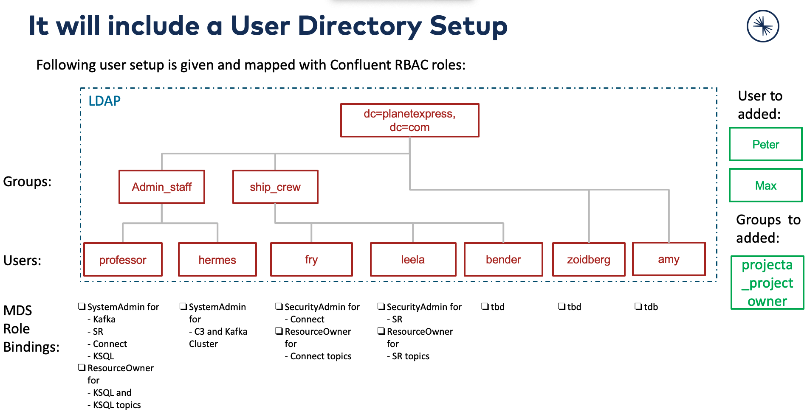

# Lab 1: Check the RBAC environment on local machine
If the environment is not started yet, please do so in cloud compute instance:
The docker-compose project is `rbac`. 
```bash
cd confluent-rbac-hands-on-master/rbac-docker
./confluent-start.sh
# set the IDs of cluster
. ./clusterids
# Check one ID, if set
echo $KAFKA_ID
# Check docker is up and running
docker-compose -p rbac ps
```
You can also get the cluster IDs as followed:
```bash
confluent cluster describe --url http://localhost:8090
export KAFKA_ID=4kbPYT2BTtaHJYa6-JgzwA # please use output from previous command
```
You can also check the logs if something is not up, check logs:
```bash
docker-compose -p rbac logs ksql-server
docker-compose -p rbac logs control-center
```
Kafka broker is available at `localhost:9094` (note, not 9092). All other services are at localhost with standard ports (e.g. C3 is 9021 etc).

| Service         | Host:Port        |
| --------------- | ---------------- |
| Kafka           | `localhost:9094` |
| MDS             | `localhost:8090` |
| C3              | `localhost:9021` |
| Connect         | `localhost:8083` |
| KSQL            | `localhost:8088` |
| OpenLDAP        | `localhost:389`  |
| Schema Registry | `localhost:8081` |

If you are working from your machine with the cloud environment, from where you deployed the cloud compute then please use the Public IP instead of localhost.
Before setting Max to SystemAdmin please add missing users to LDAP:
```bash
### Add users and groups
docker exec -it openldap bash
ldapadd -x -D "cn=admin,dc=planetexpress,dc=com" -w GoodNewsEveryone -H ldap:// -f /etc/add-user/add-user.ldif
exit
```

Try to login into Confluent MDS service, use professor/professor
```bash
confluent login --url http://localhost:8090
```
Add Max to the Role System Admin for Kafka cluster
```bash
confluent iam rolebinding create \
    --principal User:max  \
    --role SystemAdmin \
    --kafka-cluster-id $KAFKA_ID
```
Check LDAP Users in openLDAP:
```bash
ldapsearch -D "cn=Hubert J. Farnsworth,ou=people,dc=planetexpress,dc=com" -w professor -p 389 -h localhost -b "dc=planetexpress,dc=com" -s sub "(objectclass=*)"
```
Or open ApacheDirectory Studio and login as cn=admin,dc=planetexpress,dc=com with password GoodNewsEveryone
We use the docker container for openLDAP. Please see the description [here](https://github.com/rroemhild/docker-test-openldap)

After Deployment the following setup is configured


go back to [to Lab Overview](https://github.com/ora0600/confluent-rbac-hands-on#hands-on-agenda-and-labs)
