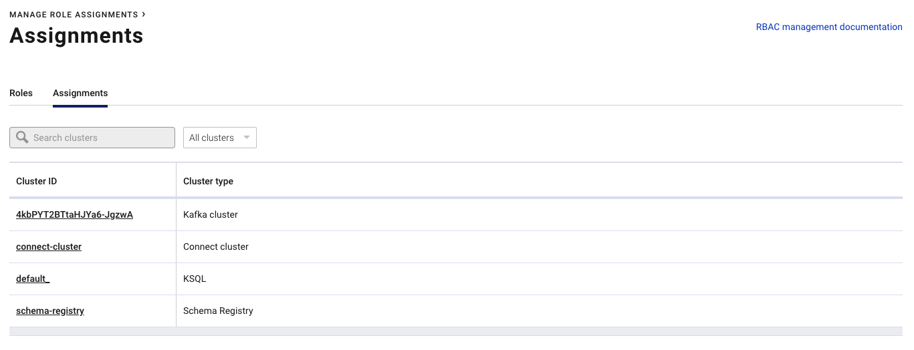

# Lab 2: Short Demo
Now check what is this deployment about:
Start to list all role bindings. Login as SuperUser to MDS Service: 
```bash
# login as professor with password professor
confluent login --url http://localhost:8090
# Check role bindings of professor, but you can also use other user or groups
confluent iam rolebinding list --principal User:professor --kafka-cluster-id $KAFKA_ID
```
In parallel you can check in Control-Center the setup as well. Goto [http://localhost:9021](http://localhost:9021) and check first the cluster IDs: right top hamburger menu -> Click manage role assignments -> Choose Assignments


now list all rolebindings step by step
```bash
confluent iam rolebinding list --principal User:professor --kafka-cluster-id $KAFKA_ID 
confluent iam rolebinding list --principal User:professor --kafka-cluster-id $KAFKA_ID --ksql-cluster-id default_
confluent iam rolebinding list --principal User:hermes --kafka-cluster-id $KAFKA_ID
confluent iam rolebinding list --principal User:leela --kafka-cluster-id $KAFKA_ID --schema-registry-cluster-id schema-registry
confluent iam rolebinding list --principal User:fry --kafka-cluster-id $KAFKA_ID --connect-cluster-id connect-cluster
```
or use one command to list all (env variable $KAFKA_ID is already set in aws compute) rolebindings:
```bash
# check if env is set
echo $KAFKA_ID
for i in "professor" "hermes" "leela" "fry" "amy" "bender" "carsten"; do echo "confluent iam rolebinding list --principal User:${i} --kafka-cluster-id ${KAFKA_ID}"; confluent iam rolebinding list --principal User:${i} --kafka-cluster-id ${KAFKA_ID}; done
```
you can also check the security with Confluent Control Center. Use [http://localhost:9021](http://localhost:9021)


Try to login with different user in control center and check what these user can do:
* User: professor is SystemAdmin
* User: hermes is SystemAdmin
* User: fry is Security Admin for Connect
* User: leela is Security Admin for Schema Registy
* User: bender? 

go back to [to Lab Overview](https://github.com/ora0600/confluent-rbac-hands-on#hands-on-agenda-and-labs)