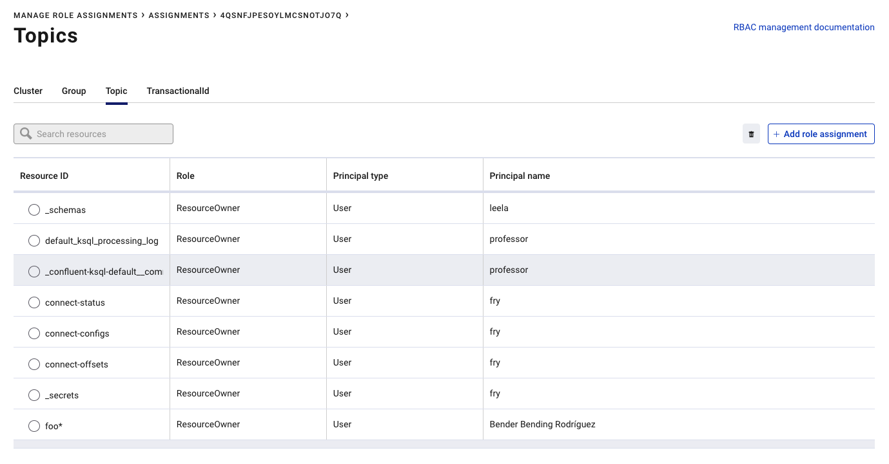

# Lab 3. First Authorization check
First show configs property files:
```
cd confluent-rbac-hands-on-master/rbac-docker/client-configs/
ls
cat professor.properties
cat bender.properties
```
Now, try to create a topic as user bender (should fail):
```
kafka-topics --bootstrap-server localhost:9094 --create --topic cmtest --partitions 1 --replication-factor 1 --command-config bender.properties
```
see error statement `[Authorization failed.]`

Try now as professor, he is the SuperUser:
```
kafka-topics --bootstrap-server localhost:9094 --create --topic test1 --partitions 1 --replication-factor 1 --command-config professor.properties
kafka-topics --bootstrap-server localhost:9094 --list --command-config professor.properties
```
Try all the URLs as short demo :
  * go to control center as professor http://publicip:9021 or 
  * logout try as Hermes, he is also SystemAdmin http://publicip :9021
  * He did not see CONNECT, KSQL and has no access to Schema Registry (Topic View)

Try Schema Registry
* as unauthoried user:
```
curl localhost:8081/subjects
```
* As Authroized User:
```
curl -u professor:professor localhost:8081/subjects
# Showed empty Schema
```
* try as anonymous user (is not configured):
```
curl -u ANONYMOUS localhost:8081/subjects
```
* and finally try as user frey
```
curl -u fry:fry localhost:8081/subjects
# Will show empty Schema
```
First move to the client configs
```bash
cd confluent-rbac-hands-on-master/rbac-docker/client-configs
```
Create Schema for TEST1
```bash
curl -u professor:professor -X POST -H "Content-Type: application/vnd.schemaregistry.v1+json" --data '{"schema": "{\"type\":\"record\",\"name\":\"Payment\",\"namespace\":\"io.confluent.examples.clients.basicavro\",\"fields\":[{\"name\":\"id\",\"type\":\"string\"},{\"name\":\"amount\",\"type\":\"double\"}]}"}' http://localhost:8081/subjects/test1-value/versions
```
Get Schema from Schema Registry;
```bash
curl -u professor:professor localhost:8081/subjects
```
Check Schema also in C3 http://publicip:9021 or http://localhost:9021 as user professor. Go to topic test1 and then Schema. 
Load data into test2 topic and create it first
```bash
# create topic
kafka-topics --bootstrap-server localhost:9094 --create --topic test2 --partitions 1 --replication-factor 1 --command-config professor.properties
# Now produce data into topic
kafka-console-producer --broker-list localhost:9094 \
--producer.config professor.properties --topic test2 
# Enter
{"f1":"001"}
{"f1": "002"}
{"f1": "003"}
{"f1": "004"}
CTRL+c
```
Create SCHEMA for TEST2
```bash
curl -u professor:professor -X POST -H "Content-Type: application/vnd.schemaregistry.v1+json" --data '{"schema": "{\"type\":\"record\",\"name\":\"myrecord\",\"namespace\":\"io.confluent.examples.clients.basicavro\",\"fields\":[{\"name\":\"f1\",\"type\":\"string\"}]}"}' http://localhost:8081/subjects/test2-value/versions
```
Get all Schemas
```bash
curl -u professor:professor localhost:8081/subjects
```
Get data of Schema for test2
```bash
curl -u professor:professor localhost:8081/subjects/test2-value/versions/latest
```
You may also check in C3 if you want.

Consume Data from TEST2 as professor
```bash
kafka-console-consumer --bootstrap-server localhost:9094 \
--consumer.config professor.properties --topic test2 --from-beginning
```

Use KSQL cli and play aroud, first with fry (not allowed):
```bash
ksql -u fry -p fry http://localhost:8088
ksql> show topics;
ksql> print 'test2' from beginning;
ksql> exit
```

Now, login as professor (Superuser)
```bash
ksql -u professor -p professor http://localhost:8088
ksql> show topics;
ksql> show streams;
ksql> CREATE STREAM TEST2STREAM (NAME STRING) WITH (VALUE_FORMAT='JSON', KAFKA_TOPIC='test2', PARTITIONS=1, REPLICAS=1);
ksql> describe extended TEST2STREAM;
ksql> SET 'auto.offset.reset'='earliest';
ksql> select * from TEST2STREAM emit changes;
```

Open a second Terminal and produce data into topic JIMNEWTOPIC
```bash
kafka-console-producer --broker-list localhost:9094 --producer.config professor.properties --topic test2
Hallo
Warum
Ist
das
so?
# enter CTRL+c to stop producing
```
The producer data should be visible in Terminal 1 (KSQL cli open select).

Now, enable user Bender for some specific work.
First Grant User:bender ResourceOwner to prefix Topic:foo on Kafka cluster KAFKA_ID:
```bash
confluent login --url http://localhost:8090 # as professor
confluent cluster describe --url http://localhost:8090
export KAFKA_ID=4QSNFjpeSoyLMCsNOTJo7Q
confluent iam rolebinding create --principal User:bender --kafka-cluster-id $KAFKA_ID --role ResourceOwner --resource Topic:foo --prefix
```
You can do this also with Control Center;


List created rolebinding:
```bash
confluent iam rolebinding list --principal User:bender --kafka-cluster-id $KAFKA_ID
```

Create topic and produce data as bender:
```bash
kafka-topics --bootstrap-server localhost:9094 --create --topic foo.topic1 --partitions 1 --replication-factor 1 --command-config bender.properties
# List topic, should only list foo.topic1
kafka-topics --bootstrap-server localhost:9094 --list  --command-config bender.properties
# produce into topic
seq 1000 | kafka-console-producer --broker-list localhost:9094 --producer.config bender.properties --topic foo.topic1
```

Try to consume of topic as bender (should fail):
```bash
kafka-console-consumer --bootstrap-server localhost:9094 \
--consumer.config bender.properties --topic foo.topic1 --from-beginning
```

There are some missing roles for bender, add them:
```bash
# READ Role
confluent iam rolebinding create \
--principal User:bender \
--role DeveloperRead \
--resource Topic:foo.topic1 \
--prefix \
--kafka-cluster-id $KAFKA_ID
# Still one role missing to access to consumer group, add: 
confluent iam rolebinding create \
--principal User:bender \
--role DeveloperRead \
--resource Group:console-consumer- \
--prefix \
--kafka-cluster-id $KAFKA_ID
```

Consume again, now should work
```bash
kafka-console-consumer --bootstrap-server localhost:9094 \
--consumer.config bender.properties --topic foo.topic1 --from-beginning
```

List roles for bender
```bash
confluent iam rolebinding list --principal User:bender --kafka-cluster-id $KAFKA_ID
```

This was a short overview of configured RBAC environment.

go back to [to Lab Overview](https://github.com/ora0600/confluent-rbac-hands-on#hands-on-agenda-and-labs)