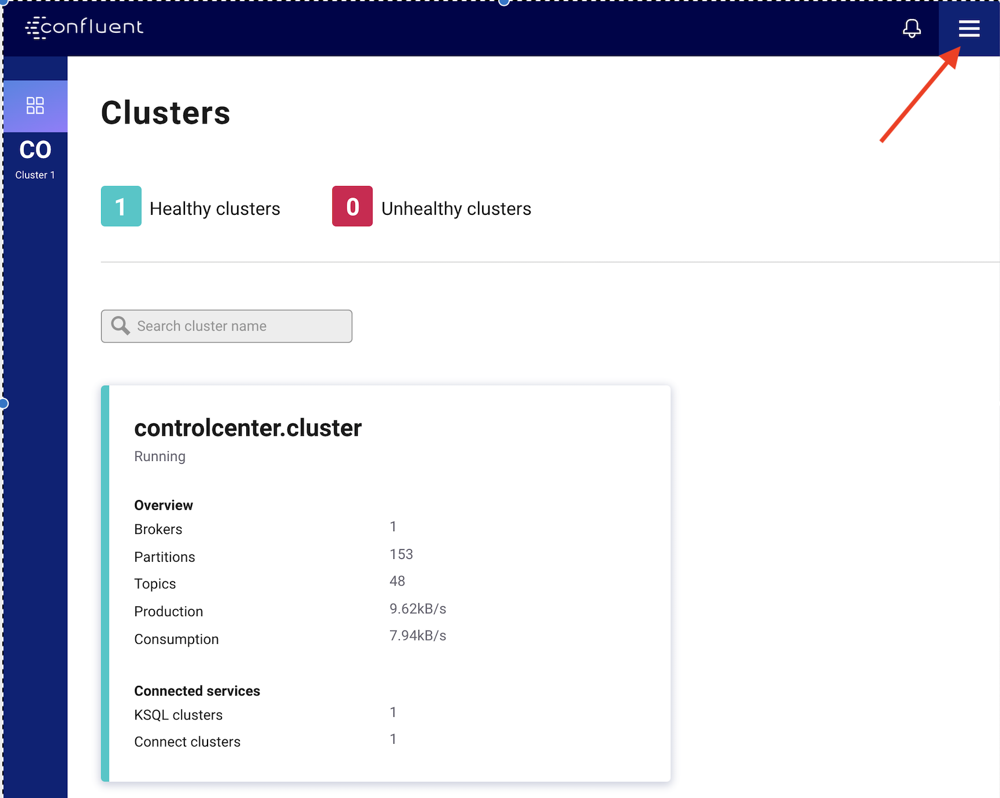
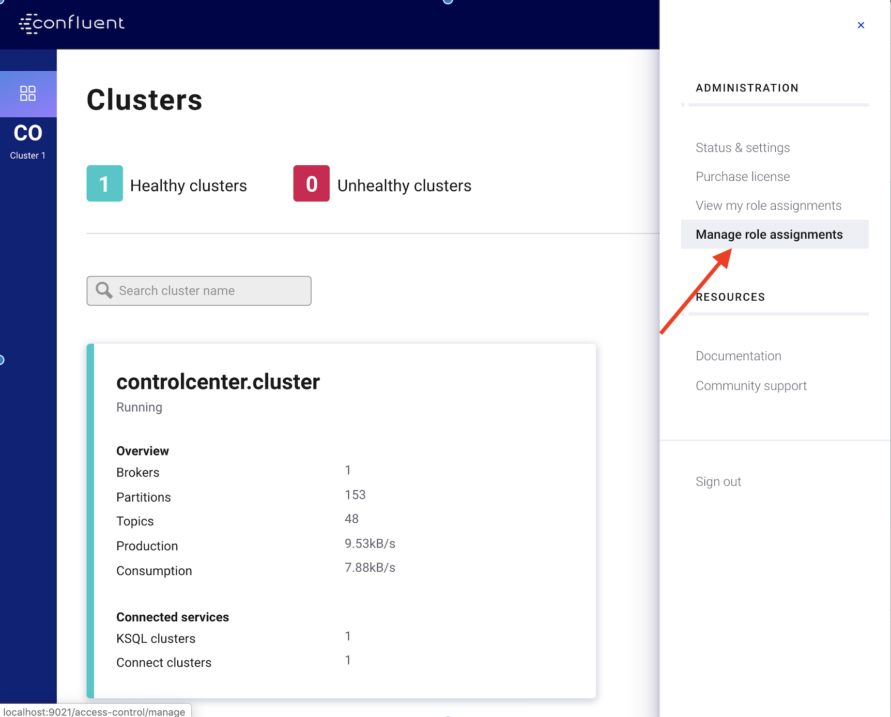
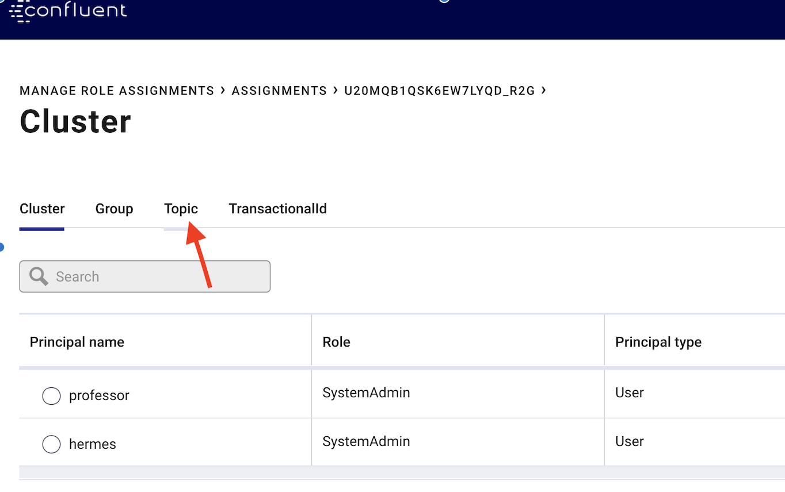

# Lab 3. First Authorizations - Project Eagle
We start now with a new use case.
We have a project with a name "eagle" and there is a project team. In the project eagle team there are currently 3 members/users (peter, carsten, suvad).
Project owner is peter; carsten and suvad are developers.

Now RBAC admin (professor) wants to delegate project authorization responsibility to peter as the project owner of the project eagle.

 * Login to control center as professor http://publicip:9021 ( http://localhost:9021 )

 * Go to the right corner
   
 * and choose "Manage role assignements"
   
 * Go to Assignments
   
 * Choose your Kafka cluster, and click then on Topic
   
 * Click on "+ Add role assignment"

   * Then select for 1. dropdown ("Principal Type") "User"
   * as User select "peter" from the list,
   * Role select "ResourceOwner",
   * Pattern type is "Prefixed"
   * Resource ID is "eagle_"
   * and then click on "save".

Now is peter able to create topics with prefix "eagle_" and peter is able to authorize people to access topics with prefix "eagle_". Cool! 

Login to the Control Center as peter and 

 * Create a topic with prefix eagle_ (Look during typing eagle, there is no possibility to create topic until the prefix is full). Name it eagle_topic1

Now logout and login as carsten or suvad in the control center and check if you are able to see any topics. Should be not possible.

Now login again as peter and choose "Manage role assignments"
 * select assignments
 * Click on kafka cluster
 * go to the topic area
 * Click on "+ Add role assignment"
   * choose principal type Group
   * choose group eagle_team
   * choose Role "DeveloperWrite"
   * Pattern type is "Prefixed"
   * Resource ID is "eagle_"
   * and then click on "save".

Login again as carsten or suvad and check if you can see any topics. You should see topic "eagle_topic1"

Run console producer to create some data in the topic "eagle_topic1" as user suvad (carsten)
```bash
# check if you are in the right directory rbac-docker, if yes start produce
kafka-console-producer --broker-list localhost:9094 --producer.config client-configs/suvad.properties --topic eagle_topic1
> Hallo
> wie gehts
> ?
# to cancel
CTRL+C
```

Lets now try to consume data from eagle_topic1 as suvad. It should fail.
```bash
# check if you are in the right directory rbac-docker, if yes start consume
kafka-console-consumer --bootstrap-server localhost:9094 \
--consumer.config client-configs/suvad.properties --topic eagle_topic1 --from-beginning
```
see error statement `[Authorization failed.]`

Lets authorize peter to provide his eagle_team access to eagle_* topics.
But at this point we will REST API to create RBAC role bindings (access policies):

1) We will need to authorize peter to be ResourceOwner for consumer group with "eagle_" prefix
```bash
# Check KAFKA_ID is set
echo $KAFKA_ID
curl -i -u professor:professor -X POST "http://localhost:8090/security/1.0/principals/User%3Apeter/roles/ResourceOwner/bindings" \
-H "accept: application/json" -H "Content-Type: application/json" \
-d "{\"scope\":{\"clusters\":{\"kafka-cluster\":\"$KAFKA_ID\"}},\"resourcePatterns\":[{\"resourceType\":\"Group\",\"name\":\"eagle_\",\"patternType\":\"PREFIXED\"}]}"
```
You can doublecheck this setting in Control Center: Login as Peter -> go my Role Assignment -> Choose Kafka Cluster -> click on Group tab

2) Now as user peter lets authorize eagle_team with DeveloperRead to access topics with "eagle_" prefix:
```bash
# Check KAFKA_ID is set
echo $KAFKA_ID
curl -i -u peter:peter -X POST "http://localhost:8090/security/1.0/principals/Group%3Aeagle_team/roles/DeveloperRead/bindings" \
-H "accept: application/json" -H "Content-Type: application/json" \
-d "{\"scope\":{\"clusters\":{\"kafka-cluster\":\"$KAFKA_ID\"}},\"resourcePatterns\":[{\"resourceType\":\"Topic\",\"name\":\"eagle_\",\"patternType\":\"PREFIXED\"}]}"
```

3) And finally lets authorize eagle_team with DeveloperRead to access/join consumer group with "eagle_" prefix
```bash
# Check KAFKA_ID is set
echo $KAFKA_ID  
curl -i -u peter:peter -X POST "http://localhost:8090/security/1.0/principals/Group%3Aeagle_team/roles/DeveloperRead/bindings" \
-H "accept: application/json" -H "Content-Type: application/json" \
-d "{\"scope\":{\"clusters\":{\"kafka-cluster\":\"$KAFKA_ID\"}},\"resourcePatterns\":[{\"resourceType\":\"Group\",\"name\":\"eagle_\",\"patternType\":\"PREFIXED\"}]}"
```
If you now login as suvad you should see all the assignment under my role assignments for suvad derived from Group eagle_team assignment:
For the Group:

For the Topic:


Lets now try to consume data from eagle_topic1 as suvad. It should work.
```bash
kafka-console-consumer --bootstrap-server localhost:9094 \
--consumer.config client-configs/suvad.properties --topic eagle_topic1 --from-beginning --group eagle_cg1
# close consume with CTRL+c
```

go back to [to Lab Overview](https://github.com/ora0600/confluent-rbac-hands-on#hands-on-agenda-and-labs)
